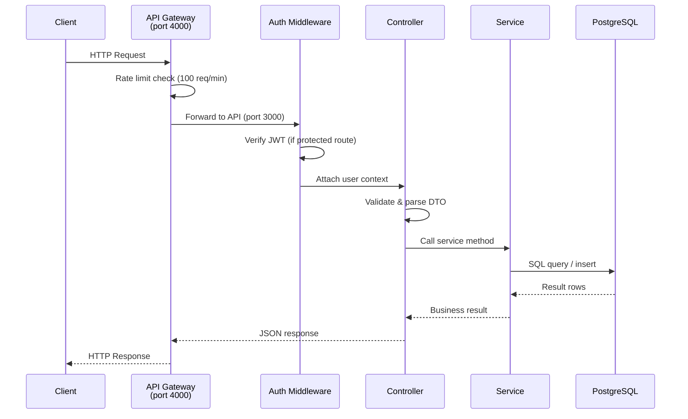
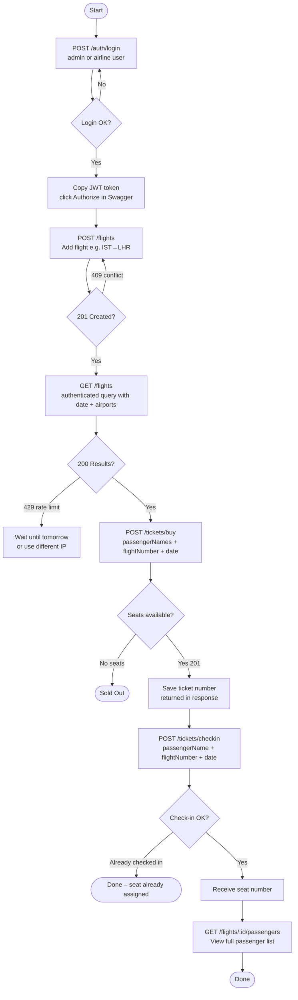

# Airline API – SE4458 Midterm Group 1

REST API for an airline ticketing system built with **Node.js + Express + PostgreSQL**.

---

## Design & Assumptions

### Architecture
```
Client → API Gateway (port 4000) → Airline API (port 3000) → PostgreSQL (Neon)
```

- **Service-Oriented**: Routes → Controllers → Services → DB. No database calls in controllers.
- **DTOs**: All request/response data flows through DTO classes for validation and mapping.
- **API Versioning**: All endpoints prefixed with `/api/v1/`.
- **Authentication**: JWT Bearer tokens (8-hour expiry). Call `/api/v1/auth/login` to get a token.
- **Gateway**: `gateway.js` handles rate limiting (100 req/min global) and structured request/response logging.

### Assumptions
1. `dateFrom` and `dateTo` on a flight record represent the **departure** and **arrival** dates of the flight (may be same day for short routes).
2. **Query Flight** "3 per day" limit is enforced per IP address using a database table (`query_rate_limits`), not gateway-level rate limiting.
3. For **round-trip** queries, the API returns both outbound (A→B) and return (B→A) flights separately.
4. **Seat assignment** is simple sequential numbering (1, 2, 3...) based on the order passengers check in.
5. Multiple passengers can be booked in a single **Buy Ticket** call; `passengerNames` accepts a string or array.
6. **Authentication** is required for: Add Flight, Add Flight by File, Buy Ticket, Query Passenger List.
7. Authentication is **not** required for: Query Flight, Check In.
8. Passwords are stored as plain text for this demo. Use bcrypt in production.

---

## Architecture Diagrams

### Request Flow – Sequence Diagram



### User Flow Diagram



---

## Data Model (ER Diagram)

```
┌─────────────────────┐       ┌──────────────────────────┐
│       users         │       │        flights           │
├─────────────────────┤       ├──────────────────────────┤
│ id          SERIAL  │       │ id            SERIAL     │
│ username    VARCHAR │       │ flight_number VARCHAR(20)│
│ password    VARCHAR │       │ date_from     DATE       │
│ role        VARCHAR │       │ date_to       DATE       │
└─────────────────────┘       │ airport_from  VARCHAR(10)│
                              │ airport_to    VARCHAR(10)│
                              │ duration      INTEGER    │
                              │ capacity      INTEGER    │
                              │ available_seats INTEGER  │
                              │ created_at    TIMESTAMP  │
                              └──────────┬───────────────┘
                                         │ 1
                                         │
                                         │ N
                              ┌──────────┴───────────────┐
                              │        tickets           │
                              ├──────────────────────────┤
                              │ id            SERIAL     │
                              │ ticket_number VARCHAR(50)│
                              │ flight_id     INTEGER FK │
                              │ passenger_name VARCHAR   │
                              │ flight_date   DATE       │
                              │ status        VARCHAR(20)│
                              │ seat_number   INTEGER    │
                              │ created_at    TIMESTAMP  │
                              └──────────────────────────┘

┌──────────────────────────────┐
│      query_rate_limits       │
├──────────────────────────────┤
│ id          SERIAL           │
│ identifier  VARCHAR (IP)     │
│ query_date  DATE             │
│ call_count  INTEGER          │
└──────────────────────────────┘
```

---

## Setup

### 1. Database
Create a free PostgreSQL database on [Neon](https://neon.tech) (or any PostgreSQL provider).
Run `schema.sql` in your database console.

### 2. Environment
```bash
cp .env .env.local
# Edit .env and set your DATABASE_URL and JWT_SECRET
```

### 3. Install & Run
```bash
cd airline-api
npm install

# Terminal 1 – Start API
npm start          # or: npm run dev

# Terminal 2 – Start Gateway
npm run gateway
```

### 4. Open Swagger
- Via Gateway: http://localhost:4000/api-docs
- Direct API:  http://localhost:3000/api-docs

---

## API Endpoints

| Method | Endpoint                                | Auth  | Paging | Description                        |
|--------|-----------------------------------------|-------|--------|------------------------------------|
| POST   | `/api/v1/auth/login`                    | No    | No     | Get JWT token                      |
| POST   | `/api/v1/flights`                       | YES   | No     | Add a flight                       |
| POST   | `/api/v1/flights/upload`                | YES   | No     | Add flights from CSV file          |
| GET    | `/api/v1/flights`                       | No    | YES    | Query available flights (3/day)    |
| POST   | `/api/v1/tickets/buy`                   | YES   | No     | Buy ticket(s)                      |
| POST   | `/api/v1/tickets/checkin`               | No    | No     | Check in a passenger               |
| GET    | `/api/v1/flights/:flightNumber/passengers` | YES | YES  | Query passenger list               |

### Test Credentials
| Username | Password   | Role  | Can do                         |
|----------|------------|-------|--------------------------------|
| admin    | adminpass  | admin | Add flights, view passengers   |
| airline  | userpass   | user  | Buy tickets                    |

---

## CSV File Format (Add Flight by File)

Upload a `.csv` file with this header row:

```csv
flight_number,date_from,date_to,airport_from,airport_to,duration,capacity
TK101,2025-06-15,2025-06-15,IST,LHR,225,180
TK102,2025-06-15,2025-06-15,LHR,IST,225,180
```

See `sample-flights.csv` for a full example.

---

## Load Testing (k6)

### Install k6
```bash
# Windows (via Chocolatey)
choco install k6

# Or download from https://k6.io/docs/get-started/installation/
```

### Get JWT Token First
```bash
curl -X POST http://localhost:4000/api/v1/auth/login \
  -H "Content-Type: application/json" \
  -d '{"username":"airline","password":"userpass"}'
```

### Run Tests
```bash
# Query Flight load test (no token needed)
k6 run load-tests/query-flight.js

# Buy Ticket load test (token required)
k6 run --env JWT_TOKEN=<your_token> load-tests/buy-ticket.js
```

---

## Load Test Results

> *(Fill in after running tests against your deployed instance)*

### Endpoints Tested
1. **GET /api/v1/flights** – Query Flight
2. **POST /api/v1/tickets/buy** – Buy Ticket

### Test Scenarios

| Scenario    | VUs | Duration |
|-------------|-----|----------|
| Normal Load | 20  | 30s      |
| Peak Load   | 50  | 30s      |
| Stress Load | 100 | 30s      |

### Results Table

| Scenario    | Avg Response (ms) | p95 (ms) | Req/sec | Error Rate |
|-------------|-------------------|----------|---------|------------|
| Normal (20) | -                 | -        | -       | -          |
| Peak (50)   | -                 | -        | -       | -          |
| Stress (100)| -                 | -        | -       | -          |

### Analysis
*(Write 3–5 sentences after running tests)*

The API performed well under normal load conditions with acceptable response times.
Under peak and stress loads, response times increased due to database connection pool saturation.
The main bottleneck identified was the PostgreSQL query for available seats with concurrent write operations on the same flight row.
Potential improvements include adding a caching layer (Redis) for flight availability reads and using database-level row locking or optimistic concurrency for seat decrements.
Horizontal scaling via multiple API instances behind a load balancer would also significantly improve throughput.

---

## Deployment (AWS App Runner)

1. Push code to GitHub.
2. Create a PostgreSQL database on Neon (free tier).
3. In AWS App Runner, connect your GitHub repo.
4. Set environment variables: `DATABASE_URL`, `JWT_SECRET`.
5. Deploy – App Runner auto-builds from your repo.
6. Update `swagger.js` server URL to your App Runner URL.

---

## Issues Encountered

- **Rate limiting for Query Flight**: Implemented at DB level instead of gateway level because the requirement is "3 per day" (not per minute), which requires persistent storage across restarts.
- **Round-trip search**: The spec asks for one-way/round-trip but doesn't specify the response format difference. The API returns `outbound` and `return` arrays for round-trip.
- **Multiple passengers**: Buy Ticket accepts both a string and array for `passengerNames` for flexibility.
